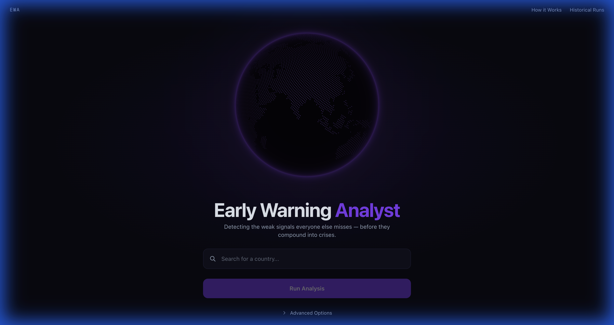
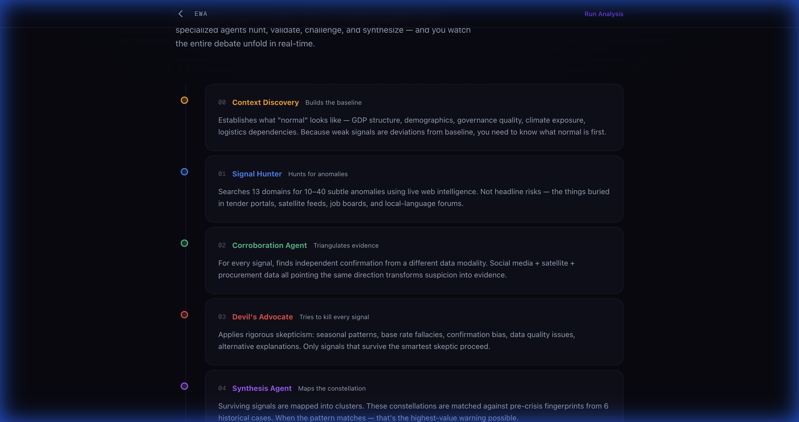
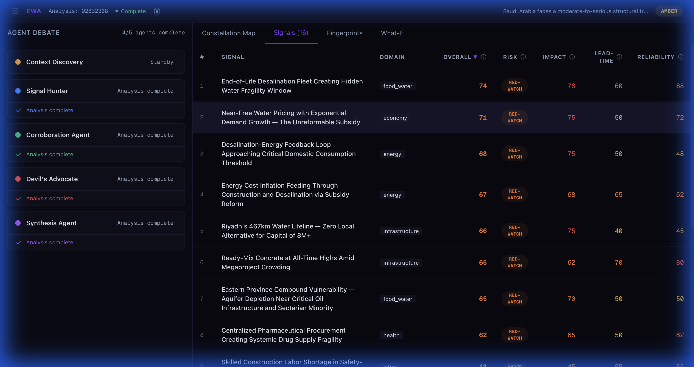
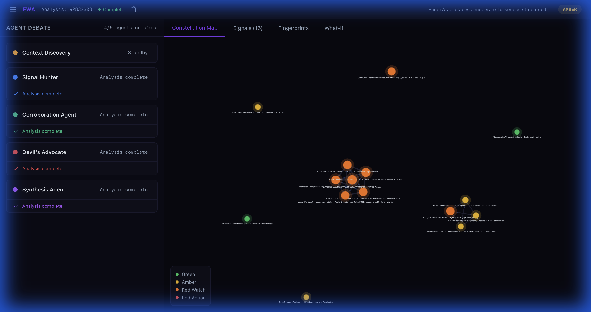
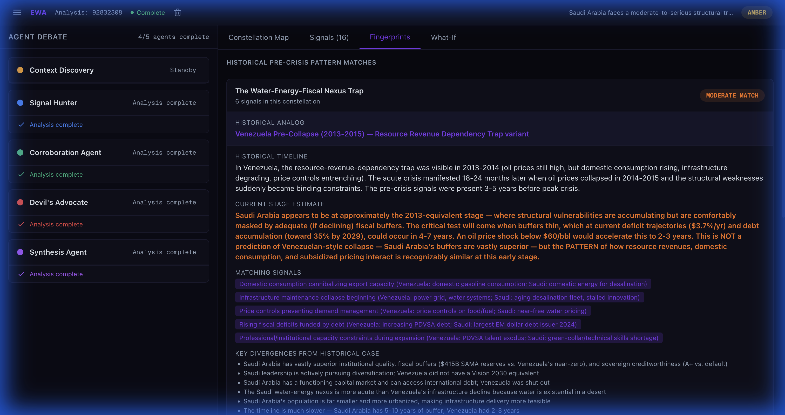
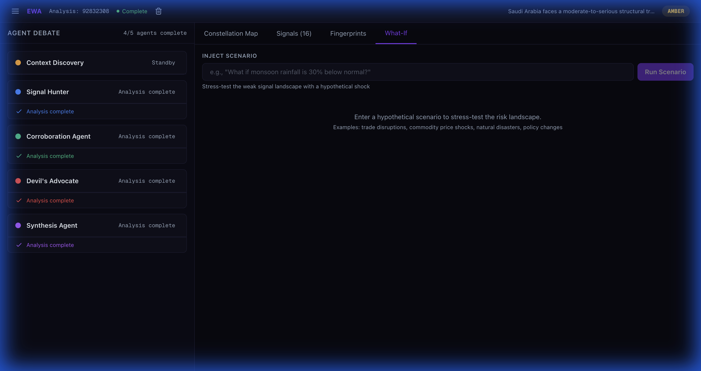

<div align="center">

# 🌐 Early Warning Analyst (EWA)

### *Detecting the weak signals everyone else misses — before they compound into crises.*

[](https://early-warning-analyst.vercel.app/)
[](https://anthropic.com)
[](https://fastapi.tiangolo.com/)
[](https://nextjs.org/)

<br />



<br />

*An AI-powered multi-agent system that deploys five adversarial agents to autonomously discover, validate, stress-test, and synthesize weak signals of emerging crises for any country.*

</div>

---

## 📌 The Problem

Every major crisis of the last two decades — **Sri Lanka's sovereign default**, **Lebanon's financial collapse**, **the Arab Spring** — was preceded by months or years of weak, individually unremarkable signals that only became obvious in hindsight.

- A quiet change in **fertilizer subsidy policy**.
- An unusual pattern in **central bank reserve drawdowns**.
- A subtle shift in **water table data** that nobody cross-referenced with energy import dependency.

> **The signals were there. The problem was never a lack of data — it was that no human analyst can simultaneously monitor dozens of domains across hundreds of data streams and recognize when a cluster of seemingly unrelated anomalies matches a historical pre-crisis pattern.**

### Why Existing Systems Fail

| System Type | What It Does | The Gap |
|:---|:---|:---|
| **Government Frameworks** (FEWS NET, Global Crisis Risk Index) | Track lagging indicators — GDP contraction, inflation spikes, conflict counts | Confirm crises *already underway* rather than forecasting them |
| **Academic Models** | Offer better lead time but are narrow and domain-specific | A food security model won't detect that a country's desalination fleet is aging while energy revenues decline |
| **Static Dashboards** | Aggregate known metrics into risk scores | Miss the **cross-domain interactions** where a water stress signal amplifies an energy vulnerability that triggers a fiscal cascade |

It is precisely these **cross-domain interactions** — where vulnerabilities in one system silently amplify risks in another — that produce the **most dangerous and least predicted crises**.

---

## 🧠 How EWA Works — Five Adversarial Agents

EWA addresses this gap with a **multi-agent adversarial architecture**. Five specialized AI agents — each powered by **Claude Opus 4** with real-time web search — work in sequence to discover, validate, challenge, and synthesize weak signals.

<div align="center">

</div>

<br />

### Agent Pipeline

```
Country Input → Context Discovery → Signal Hunter → Corroboration → Devil's Advocate → Synthesis → Risk Assessment
                    │                    │                │                 │                │
                    ▼                    ▼                ▼                 ▼                ▼
              Builds baseline     Hunts 13 domains   Triangulates     Tries to kill     Maps constellations
              country profile     for anomalies      evidence         every signal      & matches fingerprints
```

| # | Agent | Role | What It Does |
|:-:|:------|:-----|:-------------|
| 00 | 🟡 **Context Discovery** | *Builds the baseline* | Establishes what "normal" looks like — GDP structure, demographics, governance quality, climate exposure, logistics dependencies. Weak signals are deviations from baseline, so you need to know what normal is first. |
| 01 | 🔵 **Signal Hunter** | *Hunts for anomalies* | Searches 13 domains for 10–40 subtle anomalies using live web intelligence. Not headline risks — the things buried in tender portals, satellite feeds, job boards, and local-language forums. |
| 02 | 🟢 **Corroboration Agent** | *Triangulates evidence* | For every signal, finds independent confirmation from a different data modality. Social media + satellite + procurement data all pointing the same direction transforms suspicion into evidence. |
| 03 | 🔴 **Devil's Advocate** | *Tries to kill every signal* | Applies rigorous skepticism: seasonal patterns, base rate fallacies, confirmation bias, data quality issues, alternative explanations. Only signals that survive the smartest skeptic proceed. |
| 04 | 🟣 **Synthesis Agent** | *Maps the constellation* | Surviving signals are mapped into clusters. These constellations are matched against pre-crisis fingerprints from 6 historical cases. When the pattern matches — that's the highest-value warning possible. |

> Each signal receives a **deterministic risk score**; the overall assessment is categorized from **🟢 Green (monitor)** to **🔴 Red-Action (critical)**.

---

## 🖥️ Features & Interface

### Signals Dashboard

The core analytical view surfaces every discovered signal with deterministic scoring across four dimensions: **Overall Risk**, **Impact**, **Lead-time**, and **Reliability**. Signals are domain-tagged (energy, food_water, economy, health, infrastructure, labor) and color-coded by severity.

<div align="center">

</div>

<br />

### Constellation Map

An interactive force-directed graph visualizing **cross-domain signal clusters**. Each node is a signal, sized by risk score and colored by severity. Edges reveal the causal amplification paths that make cross-domain crises so dangerous — and so hard to detect with siloed analysis.

<div align="center">

</div>

<br />

### Historical Fingerprints

Pattern-matches current signal constellations against **documented pre-crisis fingerprints** from historical cases like Sri Lanka 2019–2022, Lebanon 2017–2020, and Venezuela 2013–2015. Identifies the historical analog, estimates the current stage, and lists both matching signals and key divergences.

<div align="center">

</div>

<br />

### What-If Simulator

Lets analysts inject **hypothetical shocks** — *"What if oil drops below $50?"*, *"What if monsoon rainfall is 30% below normal?"* — and watch the AI agents re-evaluate and reshape the risk landscape in real time.

<div align="center">

</div>

<br />

### Real-Time Agent Debate (SSE Streaming)

The frontend streams the **entire analytical process in real time** via Server-Sent Events. Analysts watch the five-agent debate unfold live — signals discovered, challenged, defended, and scored — building **trust and interpretability** into every output. The left sidebar shows each agent's progress and status throughout the analysis.

---

## 🏗️ Architecture

```
┌──────────────────────────────────────────────────────────────┐
│                        Frontend                               │
│                     Next.js 16 + React 19                     │
│                                                               │
│  ┌─────────┐  ┌──────────────┐  ┌────────────┐  ┌─────────┐ │
│  │  Globe   │  │  Signals     │  │ Constell.  │  │ What-If │ │
│  │  (cobe)  │  │  Dashboard   │  │ Map (d3)   │  │ Sim     │ │
│  └─────────┘  └──────────────┘  └────────────┘  └─────────┘ │
│                        │  SSE Stream                          │
└────────────────────────┼─────────────────────────────────────┘
                         │
┌────────────────────────┼─────────────────────────────────────┐
│                   Backend (FastAPI)                            │
│                        │                                      │
│  ┌─────────────────────┼─────────────────────────────────┐   │
│  │              Agent Orchestrator                        │   │
│  │                                                        │   │
│  │  Context ──▶ Signal ──▶ Corroboration ──▶ Devil's     │   │
│  │  Discovery   Hunter     Agent            Advocate      │   │
│  │                                             │          │   │
│  │                                        Synthesis       │   │
│  │                                        Agent           │   │
│  └────────────────────────────────────────────────────────┘   │
│                        │                                      │
│              ┌─────────┴──────────┐                           │
│              │  Claude Opus 4     │                           │
│              │  (via Anthropic)   │                           │
│              └─────────┬──────────┘                           │
│                        │                                      │
│              ┌─────────┴──────────┐                           │
│              │  Firebase Firestore│                           │
│              │  (Persistence)     │                           │
│              └────────────────────┘                           │
└──────────────────────────────────────────────────────────────┘
```

### Tech Stack

| Layer | Technology | Purpose |
|:------|:-----------|:--------|
| **Frontend** | Next.js 16, React 19, TypeScript | UI framework with server-side rendering |
| **Styling** | Tailwind CSS 4 | Utility-first CSS with dark theme |
| **3D Globe** | cobe | Interactive rotating globe on homepage |
| **Graph Viz** | react-force-graph-2d | Force-directed constellation map |
| **Icons** | Lucide React | Consistent icon system |
| **Backend** | FastAPI, Python 3.11 | High-performance async API server |
| **Streaming** | SSE (sse-starlette) | Real-time agent event streaming |
| **AI Engine** | Claude Opus 4 (Anthropic API) | Multi-agent reasoning with web search |
| **Database** | Firebase Firestore | Persistent storage for analyses & longitudinal tracking |
| **Validation** | Pydantic | Request/response schema validation |
| **Deployment** | Vercel (frontend), Docker (backend) | Production hosting |

---

## 🚀 Getting Started

### Prerequisites

- **Python 3.11+**
- **Node.js 18+**
- **Anthropic API key** (Claude Opus 4 access)
- **Firebase project** with Firestore enabled

### Backend Setup

```bash
# Clone the repository
git clone https://github.com/yourusername/early-warning-analyst.git
cd early-warning-analyst

# Install Python dependencies
pip install -r backend/requirements.txt

# Configure environment variables
cp backend/.env.example backend/.env
# Edit .env with your keys:
#   ANTHROPIC_API_KEY=sk-ant-...
#   FIREBASE_PROJECT_ID=your-project-id

# Place your Firebase service account key
cp your-firebase-sa.json backend/firebase-sa.json

# Start the backend
uvicorn backend.main:app --host 0.0.0.0 --port 8000 --reload
```

### Frontend Setup

```bash
cd frontend

# Install dependencies
npm install

# Configure environment (create .env.local)
# NEXT_PUBLIC_API_URL=http://localhost:8000

# Start development server
npm run dev
```

The app will be available at `http://localhost:3000`.

### Docker (Backend)

```bash
# Build and run the backend container
docker build -t ewa-backend .
docker run -p 8000:8000 --env-file backend/.env ewa-backend
```

---

## 📁 Project Structure

```
early-warning-analyst/
├── backend/
│   ├── agents/
│   │   ├── orchestrator.py      # Multi-agent pipeline orchestration
│   │   ├── prompts.py           # System prompts for all 5 agents
│   │   └── schemas.py           # Agent I/O schemas
│   ├── models/                  # Pydantic data models
│   ├── services/                # Firebase, analysis services
│   ├── main.py                  # FastAPI app, SSE endpoints
│   └── requirements.txt
├── frontend/
│   ├── src/
│   │   ├── app/                 # Next.js app router pages
│   │   ├── components/          # React components (13 modules)
│   │   ├── hooks/               # Custom React hooks
│   │   └── lib/                 # Firebase config, utilities
│   ├── public/                  # Static assets
│   └── package.json
├── docs/screenshots/            # App screenshots
├── Dockerfile                   # Backend containerization
└── README.md
```

---

## 🔑 Key API Endpoints

| Method | Endpoint | Description |
|:-------|:---------|:------------|
| `POST` | `/api/analyze` | Start a new country analysis |
| `GET` | `/api/analyze/{id}/stream` | SSE stream of agent events |
| `GET` | `/api/runs` | List all historical analysis runs |
| `GET` | `/api/analysis/{id}` | Get completed analysis result |
| `DELETE` | `/api/analysis/{id}` | Delete an analysis |
| `POST` | `/api/analysis/{id}/what-if` | Run a What-If simulation |
| `GET` | `/api/analysis/{id}/what-if/{key}/stream` | SSE stream for What-If |

---

## 🌍 Domains Monitored

EWA's Signal Hunter searches across **13 interconnected domains**:

<div align="center">

| Domain | Examples of Weak Signals |
|:-------|:------------------------|
| 🏛️ **Governance** | Regulatory changes, institutional capacity shifts |
| 💰 **Economy / Fiscal** | Subsidy restructuring, reserve drawdowns, debt patterns |
| ⚡ **Energy** | Infrastructure aging, consumption-export imbalances |
| 💧 **Water** | Aquifer depletion, desalination dependencies |
| 🌾 **Food Security** | Procurement anomalies, supply chain fragility |
| 🏥 **Health** | Pharmaceutical procurement, workforce gaps |
| 🏗️ **Infrastructure** | Construction bottlenecks, maintenance deferrals |
| 👷 **Labor** | Skills mismatches, demographic inflection points |
| 🌍 **Environment / Climate** | Water table shifts, environmental feedback loops |
| 🛡️ **Security** | Social stability indicators, sectarian dynamics |
| 📡 **Technology** | Automation disruption, digital infrastructure |
| 🤝 **Trade / Geopolitics** | Export dependency, alliance shifts |
| 🏦 **Financial System** | Microfinance stress, banking sector exposure |

</div>

---

## 📊 Historical Fingerprints Database

EWA matches current signal patterns against documented pre-crisis fingerprints from:

- 🇱🇰 **Sri Lanka (2019–2022)** — Organic farming mandate → forex crisis → sovereign default
- 🇱🇧 **Lebanon (2017–2020)** — Banking sector Ponzi → currency collapse → state failure
- 🇻🇪 **Venezuela (2013–2015)** — Resource revenue dependency → infrastructure collapse
- 🇪🇬 **Egypt / Arab Spring (2010–2011)** — Food price spikes → social instability
- 🇬🇷 **Greece (2009–2012)** — Fiscal concealment → debt spiral → austerity crisis
- 🇦🇷 **Argentina (2017–2019)** — Capital flight → currency crisis → IMF intervention

---

## 🧭 Philosophy

> **EWA does not replace human judgment. It augments it** — giving analysts the ability to *see around corners* by systematically surfacing the weak, cross-domain signal patterns that precede cascading failures, validated through adversarial rigor that no single model call or static dashboard can provide.

The system is designed for **trust and interpretability**:

- Every signal shows its full evidence chain
- The adversarial debate is streamed live — analysts see how each signal was challenged
- Only signals surviving the Devil's Advocate gauntlet contribute to the final assessment
- Historical pattern matching provides context, not prediction — humans make the call

---

## 📄 License

This project is open source. See the [LICENSE](LICENSE) file for details.

---

<div align="center">

**Built with adversarial AI to keep analysts ahead of compounding crises.**

[🌐 Live Demo](https://early-warning-analyst.vercel.app/) · [📖 How It Works](https://early-warning-analyst.vercel.app/how-it-works)

</div>
