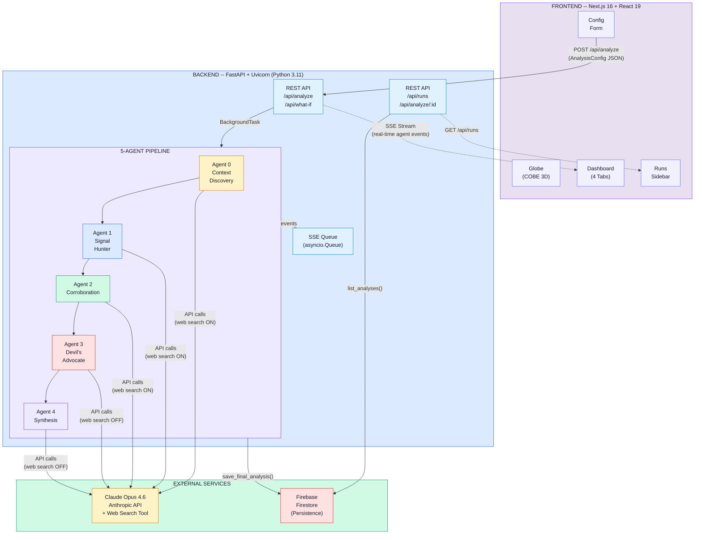

# Presentation Content — AWS AI for Bharat Hackathon

> Copy each slide's content into the corresponding slide of the PPT template.

---

## SLIDE 1 — Title

**Team Name:** Kartavya

**Problem Statement:** Governments and organizations lack the ability to detect weak, non-obvious signals of emerging crises before they compound into full-blown disasters — existing tools only surface risks after they become headline news.

**Team Leader Name:** Aayush Gupta

---

## SLIDE 2 — Brief About the Idea

**Early Warning Analyst (EWA)** is an AI-powered multi-agent intelligence system that detects weak signals of emerging crises in any country before they become visible to conventional analysis.

Instead of relying on a single AI model, EWA deploys a **5-agent adversarial pipeline** — each agent is a specialist:

1. **Context Discovery** — Builds a real-time baseline of the country using live web search
2. **Signal Hunter** — Hunts for 10-40 subtle, non-obvious anomalies across 13 domains (economy, health, climate, energy, security, etc.)
3. **Corroboration Agent** — Cross-validates each signal through independent data modalities (satellite, social media, procurement data, academic research, etc.)
4. **Devil's Advocate** — Tries to debunk every signal with mundane explanations — only signals that survive rigorous skepticism proceed
5. **Synthesis Agent** — Maps surviving signals into "constellations" and matches them against historical pre-crisis fingerprints (Sri Lanka, Lebanon, Arab Spring, etc.)

**The result:** A scored risk assessment with actionable monitoring triggers, delivered through a real-time streaming dashboard with interactive visualizations.

---

## SLIDE 3 — Solution Differentiation & USP

### How is it different from existing solutions?

| Aspect | Traditional Tools | Early Warning Analyst |
|--------|------------------|---------------------|
| Signal type | Headline indicators (GDP, inflation, credit ratings) | **Weak signals** — pharmacy stockouts, procurement anomalies, night-shift job postings, parallel market micro-premiums |
| Methodology | Single-model analysis | **5-agent adversarial pipeline** with built-in skepticism (Devil's Advocate actively tries to debunk findings) |
| Data freshness | Quarterly/annual reports | **Real-time web search** during analysis |
| Validation | Analyst review | **Automated multi-modal corroboration** across 12+ data types |
| Pattern matching | Manual comparison | **Algorithmic fingerprint matching** against 6 historical pre-crisis patterns |
| Output | Static PDF reports | **Real-time streaming dashboard** with interactive constellation graphs |

### How does it solve the problem?

EWA addresses the fundamental challenge of **intelligence blindness** — the signals that precede major crises are always visible in retrospect but dismissed as noise in real-time. By using adversarial multi-agent debate (hunt signals → validate → try to debunk → synthesize), EWA systematically surfaces risks that human analysts would dismiss.

### USP — Unique Selling Proposition

**Historical Fingerprint Matching:** EWA doesn't just find signals — it matches current weak signal constellations against the PRE-CRISIS fingerprints of 6 historical cases (Sri Lanka 2020, Lebanon 2018, Arab Spring 2010, Argentina 2017, Venezuela 2013, Turkey 2017). When a country's current signals match the invisible early pattern of a known past crisis, that is the highest-value warning possible.

---

## SLIDE 4 — Features

### Core Features

1. **Multi-Agent Adversarial Pipeline** — 5 specialized AI agents working sequentially, each adding a layer of analysis and scrutiny. Not a single-prompt system — a full analytical workflow.

2. **Weak Signal Detection Across 13 Domains** — Economy, Labor, Infrastructure, Health, Climate, Food & Water, Cyber, Logistics, Social Cohesion, Security, Energy, Education, Demographics.

3. **Live Web Search Integration** — Three of the five agents use real-time web search to find current, factual evidence. No stale training data — fresh intelligence every run.

4. **Multi-Modal Corroboration** — Each signal validated across 12+ independent data modalities (satellite, social media, procurement, academic research, financial markets, health systems, etc.)

5. **Devil's Advocate Debunking** — Built-in adversarial skepticism. Every signal must survive: mundane explanations, base rate analysis, cognitive bias checks, alternative causation, and data quality assessment.

6. **Historical Pre-Crisis Fingerprint Matching** — Matches current signal constellations against 6 known pre-crisis patterns. Answers: "Does this look like the invisible early pattern of a known past crisis?"

7. **Deterministic Risk Scoring** — Weighted composite scores (Impact 72.5%, Lead-time 16.25%, Reliability 11.25%) with 4 risk bands: Green, Amber, Red-Watch, Red-Action.

8. **What-If Scenario Simulation** — Test hypothetical scenarios ("What if oil prices spike to $120?") against an existing analysis. Shows cascade propagation, amplified/diminished signals, and new emerging signals.

9. **Real-Time Streaming Dashboard** — Watch agents work live via Server-Sent Events. Interactive signal table, force-directed constellation graph, fingerprint match panel.

10. **Subnational Analysis** — Supports department/state-level analysis, not just country-level. Critical for large, diverse nations like India.

---

## SLIDE 5 — Process Flow Diagram

### Analysis Pipeline Flow

```mermaid
flowchart LR
    CONFIG["USER CONFIG<br/>Country, Horizon,<br/>Domains, Signals"] --> A0

    A0["Agent 0<br/>CONTEXT DISCOVERY<br/>Web Search: ON"] -->|"context"| A1

    A1["Agent 1<br/>SIGNAL HUNTER<br/>Web Search: ON"] -->|"signals"| A2

    A2["Agent 2<br/>CORROBORATION<br/>Web Search: ON"] -->|"validated"| A3

    A3["Agent 3<br/>DEVIL'S ADVOCATE<br/>Web Search: OFF"] -->|"surviving"| A4

    A4["Agent 4<br/>SYNTHESIS<br/>Web Search: OFF"] --> DASH

    DASH["DASHBOARD<br/>Signals | Constellations<br/>Fingerprints | What-If"]

    style CONFIG fill:#e8e0f0,stroke:#7c3aed,color:#1a1a2e
    style A0 fill:#fef3c7,stroke:#d97706,color:#1a1a2e
    style A1 fill:#dbeafe,stroke:#2563eb,color:#1a1a2e
    style A2 fill:#d1fae5,stroke:#059669,color:#1a1a2e
    style A3 fill:#fee2e2,stroke:#dc2626,color:#1a1a2e
    style A4 fill:#ede9fe,stroke:#7c3aed,color:#1a1a2e
    style DASH fill:#f0fdf4,stroke:#16a34a,color:#1a1a2e
```

### Analysis Pipeline (Bullet Points)

- **User Configuration** — Analyst selects country, time horizon (1-10 years), number of signals (10-40), priority domains, and optional custom indicators

- **Agent 0: Country Context Discovery** (Web Search ON)
  - Establishes the baseline "normal" for the target country
  - Gathers current data on GDP, demographics, governance, climate, logistics
  - Defines what stable looks like so deviations become detectable

- **Agent 1: Signal Hunter** (Web Search ON)
  - Hunts for 10-40 weak signals across priority domains
  - Focuses on Tier 1 (deep) and Tier 2 (intermediate) signals only
  - Avoids obvious indicators like GDP decline or inflation spikes
  - Looks for: procurement anomalies, migration micro-patterns, health system edge indicators, informal economy proxies, supply chain shifts

- **Agent 2: Corroboration Agent** (Web Search ON)
  - Cross-validates each signal through independent data modalities
  - Searches for satellite, social media, procurement, academic, financial, and health data
  - Classifies corroboration: Strong (3+ modalities) / Moderate (2) / Weak (same type) / Uncorroborated
  - Updates reliability scores based on evidence strength

- **Agent 3: Devil's Advocate** (Web Search OFF — Pure Reasoning)
  - Constructs the strongest mundane explanation for each signal
  - Applies: base rate analysis, cognitive bias checks, alternative causation, data quality assessment
  - Delivers honest verdicts: debunked / partially debunked / survives
  - Only signals that survive rigorous skepticism proceed

- **Agent 4: Synthesis** (Web Search OFF — Pure Reasoning)
  - Groups surviving signals into constellations (meaningful clusters)
  - Matches against 6 historical pre-crisis fingerprints (Sri Lanka, Lebanon, Arab Spring, Argentina, Venezuela, Turkey)
  - Computes deterministic risk scores: Impact (72.5%), Lead-time (16.25%), Reliability (11.25%)
  - Assigns risk bands: Green / Amber / Red-Watch / Red-Action
  - Maps cascade paths showing how weakness propagates between domains
  - Produces overall assessment with headline, risk level, key concerns, and monitoring triggers

- **Dashboard Output** — Interactive real-time dashboard with 4 tabs: Signal Table, Constellation Graph, Fingerprint Matches, What-If Scenarios

---

## SLIDE 6 — Wireframes / Mock Diagrams (Optional)

### Dashboard Layout

**Home Page:**
- Interactive 3D globe (auto-rotates, focuses on selected country)
- Country search with autocomplete (195 countries)
- Configuration panel: horizon slider (1-10y), signal count slider (10-40), domain toggles, custom indicators
- "Run Analysis" button
- History sidebar with previous runs

**Analysis Dashboard (4 tabs):**

| Tab | Content |
|-----|---------|
| **Signals** | Sortable table — columns: Signal Name, Domain, Overall Score, Risk Band, Impact, Lead-time, Reliability. Click row → detail modal with agent perspectives, evidence chain, monitoring triggers, no-regret actions |
| **Constellation Map** | Force-directed graph. Node size = risk score. Node color = risk band. Links = same constellation. Legend for color coding |
| **Fingerprints** | Cards showing historical pattern matches: case name, match strength, matching signals, divergences, timeline, current stage estimate |
| **What-If** | Scenario input → cascade tree visualization → amplified/diminished signals → new signals → updated risk level |

**Left Sidebar (Agent Debate):**
- 5 agent cards stacked vertically (420px width)
- Each shows: agent name, status badge (searching/hunting/cross-validating/challenging/synthesizing/concluded), live streaming text with typing cursor

---

## SLIDE 7 — Architecture Diagram

---

## SLIDE 8 — Technologies Used

| Category | Technology | Purpose |
|----------|-----------|---------|
| **Frontend** | Next.js 16, React 19 | Web application framework |
| **Styling** | Tailwind CSS 4 | Responsive dark-theme UI |
| **3D Visualization** | COBE | Interactive globe for country selection |
| **Graph Visualization** | react-force-graph-2d | Signal constellation network graph |
| **Backend** | FastAPI, Uvicorn | Python async REST API |
| **AI / LLM** | Claude Opus 4.6 (Anthropic) | Multi-agent reasoning with web search |
| **Web Intelligence** | Claude Web Search Tool | Real-time data gathering during analysis |
| **Database** | Firebase Firestore | Cloud-native document storage for analysis persistence |
| **Real-time Streaming** | Server-Sent Events (SSE) | Live agent progress streaming to browser |
| **Data Validation** | Pydantic | Request/response schema validation |
| **Containerization** | Docker | Production deployment packaging |
| **Hosting** | Railway | Cloud deployment platform |
| **Language** | TypeScript (frontend), Python 3.11 (backend) | Type-safe full-stack development |

---

## SLIDE 9 — Estimated Implementation Cost (Optional)

### Per-Analysis Cost Estimate

| Component | Details | Estimated Cost |
|-----------|---------|---------------|
| Claude Opus 4.6 API | ~5 API calls per analysis, ~50K-80K input tokens, ~40K-60K output tokens | ~$3-5 per analysis |
| Firebase Firestore | ~5 read/write ops per analysis, < 1MB storage | < $0.01 per analysis |
| Railway Hosting | 1 instance, low traffic | ~$5/month (hobby tier) |
| Vercel (Frontend) | Static + SSR, low traffic | Free tier |

**Total per analysis: ~$3-5** (primarily Claude API costs)

**Monthly estimate (50 analyses/month):** ~$150-250 + $5 hosting = **~$155-255/month**

### Development Cost

- **Solo developer:** 1 person, built in < 2 weeks
- **Infrastructure:** Zero upfront cost (all pay-as-you-go services)

---

## SLIDE 10 — Additional / India Use Cases

### India-Specific Applications

EWA is a general-purpose early warning system that works for any country, but it is especially powerful for India due to:

**1. State-Level Fragility Analysis**
India's 28 states and 8 union territories have vastly different risk profiles. EWA's subnational "department" scope can analyze individual states — detecting weak signals of water stress in Rajasthan, agricultural distress in Maharashtra, or industrial decline in specific districts.

**2. Monsoon & Climate Early Warning**
India's economy is uniquely sensitive to monsoon patterns. EWA can detect subtle pre-monsoon indicators: changes in reservoir filling patterns, shifts in agricultural input purchasing, insurance claim micro-trends, and migration pattern anomalies — weeks before conventional weather-based warnings.

**3. Economic Stress Detection**
With India's complex informal economy (~80% of employment), conventional economic indicators miss emerging stress. EWA hunts for: UPI/digital payment velocity shifts, microfinance default clustering, MGNREGA enrollment anomalies, and parallel market premium changes.

**4. Public Health Surveillance**
India's health system serves 1.4 billion people across vast geography. EWA can detect: pharmacy stockout spreading patterns, ambulance response time drift, disease surveillance gaps, and health worker migration — signals that precede health system strain.

**5. Infrastructure & Energy Nexus**
India's rapid development creates interconnected vulnerabilities. EWA maps cascade paths: coal supply disruptions → power outages → water pumping failures → agricultural impact → food price inflation → social cohesion pressure.

### Example: Running EWA for India

**Config:** India, National, 5-year horizon, 20 signals, domains: Economy, Infrastructure, Health, Climate, Food & Water, Energy, Social Cohesion, Security

**Potential signals EWA would hunt for:**
- Groundwater depletion rate anomalies in specific aquifer zones
- MGNREGA demand surges as proxy for rural economic stress
- Coal stock-at-pithead divergence from seasonal norms
- Teacher vacancy rates in government schools
- UPI transaction volume growth deceleration in tier-2/3 cities
- Dam siltation rate acceleration across river basins
- Cross-border trade micro-disruptions at land ports

---

## SLIDE 11 — Thank You

**Team Kartavya**

Aayush Gupta

GitHub: [Repository Link]

*Built with Claude AI, Next.js, FastAPI, and Firebase*

*"The signals that precede crises are always visible in retrospect — EWA makes them visible in real-time."*
